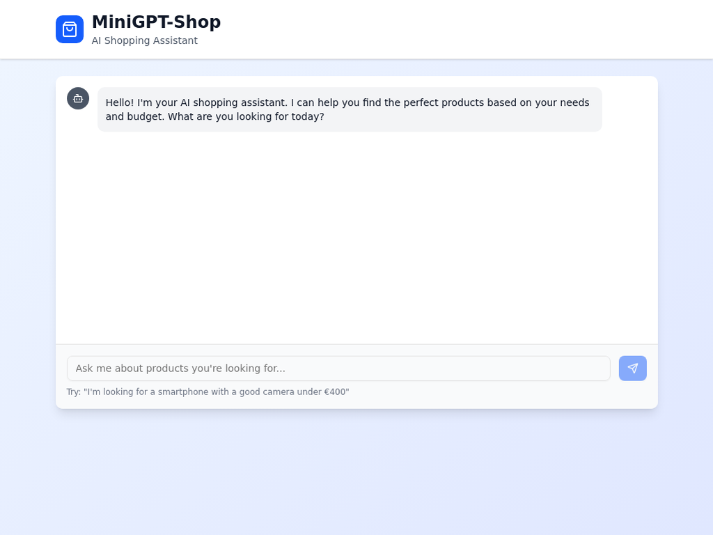
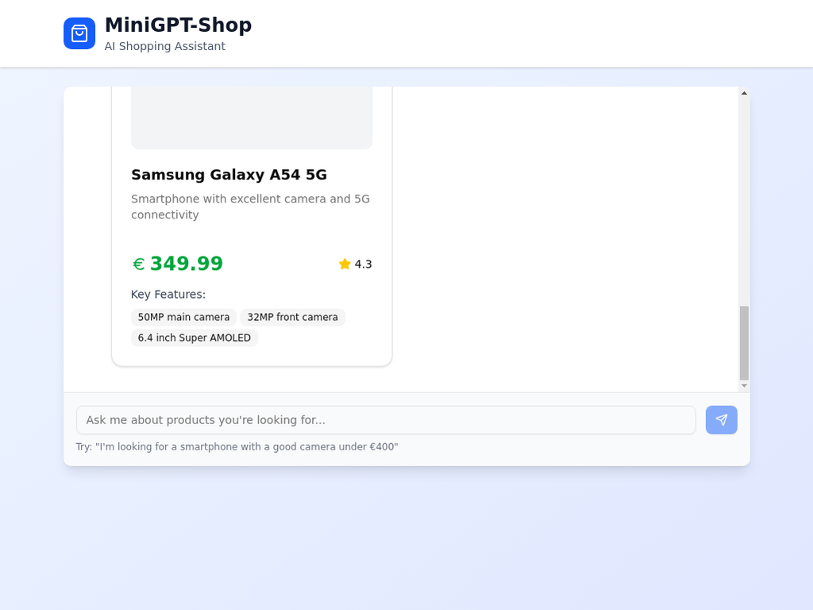
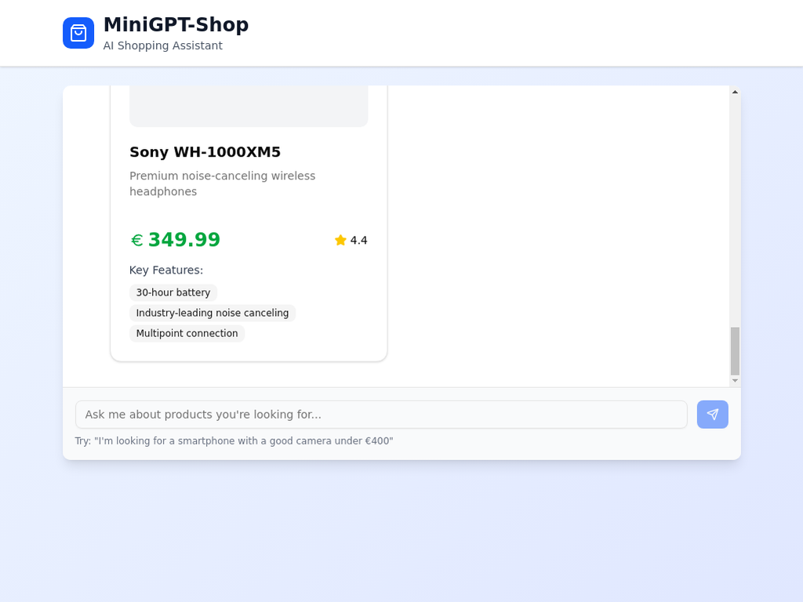

# MiniGPT-Shop – Assistant IA pour shopping intelligent

Un chatbot intelligent qui vous aide à choisir des produits en ligne selon vos besoins et votre budget. MiniGPT-Shop offre une expérience de shopping assistée par IA, fluide et personnalisée, comme un vendeur tech intelligent toujours disponible.



## 🧠 Fonctionnalités principales

### Interaction naturelle
L'utilisateur peut discuter en langage naturel avec le chatbot, que ce soit en français ou en anglais. L'IA comprend les nuances du langage et peut interpréter des demandes complexes incluant des critères spécifiques comme le budget, l'usage prévu, et les préférences personnelles.

### Compréhension intelligente des besoins
L'IA analyse automatiquement les messages des utilisateurs pour extraire :
- **Budget** : Détection automatique des montants mentionnés (€, euros)
- **Catégorie de produit** : Smartphones, ordinateurs portables, écouteurs, etc.
- **Critères spécifiques** : Qualité de caméra, autonomie, fonctionnalités particulières
- **Préférences d'usage** : Professionnel, personnel, gaming, musique, etc.

### Suggestions de produits pertinentes
Le système propose des produits adaptés basés sur une base de données mockée mais réaliste, incluant :
- **Produits filtrés** selon les critères de l'utilisateur
- **Informations détaillées** : Prix, notes, caractéristiques principales
- **Comparaison visuelle** avec cartes produits interactives
- **Tri intelligent** par pertinence et notes utilisateurs



### Interface utilisateur moderne
- **Design responsive** adapté aux mobiles et ordinateurs
- **Interface de chat intuitive** avec bulles de conversation
- **Cartes produits élégantes** avec images, prix et caractéristiques
- **Animations fluides** et indicateurs de chargement
- **Thème moderne** avec dégradés et ombres subtiles



## 💻 Technologies utilisées

### Frontend - React avec Next.js
- **React 18** avec hooks modernes (useState, useEffect, useRef)
- **Vite** comme bundler pour des performances optimales
- **Tailwind CSS** pour un styling rapide et cohérent
- **shadcn/ui** pour des composants UI professionnels
- **Lucide React** pour des icônes modernes et cohérentes
- **Design responsive** avec support mobile complet

### Backend - FastAPI
- **FastAPI** pour une API REST moderne et performante
- **Pydantic** pour la validation des données
- **CORS** configuré pour permettre les requêtes cross-origin
- **Uvicorn** comme serveur ASGI haute performance
- **Architecture modulaire** avec séparation des responsabilités

### Intelligence Artificielle (Extensible)
- **Logique de traitement** du langage naturel intégrée
- **Système de filtrage** intelligent des produits
- **Architecture prête** pour l'intégration d'OpenAI ou Mistral
- **Support prévu** pour Pinecone (recherche vectorielle)
- **Pipeline IA** extensible avec LangChain

### Base de données et recherche
- **Base de données mockée** avec produits réalistes
- **Système de filtrage** par catégorie, prix et caractéristiques
- **Architecture préparée** pour Pinecone (RAG)
- **Recherche sémantique** (implémentation future)

## 📦 Structure du projet

```
minigpt-shop/
├── backend/                 # API FastAPI
│   ├── main.py             # Point d'entrée de l'API
│   ├── requirements.txt    # Dépendances Python
│   └── .env               # Variables d'environnement
├── frontend/               # Application React
│   ├── src/
│   │   ├── App.jsx        # Composant principal
│   │   ├── App.css        # Styles Tailwind
│   │   └── components/    # Composants UI
│   ├── package.json       # Dépendances Node.js
│   └── index.html         # Point d'entrée HTML
├── screenshots/           # Captures d'écran pour documentation
└── README.md             # Documentation principale
```

## 🚀 Installation et démarrage

### Prérequis
- **Python 3.11+** installé sur votre système
- **Node.js 18+** et **pnpm** pour le frontend
- **Git** pour cloner le repository

### 1. Cloner le repository
```bash
git clone https://github.com/votre-username/minigpt-shop.git
cd minigpt-shop
```

### 2. Configuration du backend
```bash
cd backend

# Installer les dépendances Python
pip install -r requirements.txt

# Configurer les variables d'environnement (optionnel)
cp .env.example .env
# Éditer .env avec vos clés API si nécessaire

# Démarrer le serveur backend
python main.py
```

Le backend sera accessible sur `http://localhost:8000`

### 3. Configuration du frontend
```bash
cd frontend

# Installer les dépendances Node.js
pnpm install

# Démarrer le serveur de développement
pnpm run dev --host
```

Le frontend sera accessible sur `http://localhost:5173`

### 4. Accéder à l'application
Ouvrez votre navigateur et rendez-vous sur `http://localhost:5173` pour commencer à utiliser MiniGPT-Shop.

## 🎯 Exemple de cas d'usage

### Scénario : Recherche de smartphone avec budget
**Utilisateur** : "Je cherche un téléphone avec une bonne caméra, pour moins de 400€"

**Réponse du chatbot** :
- Analyse automatique du budget (400€)
- Identification de la catégorie (smartphone)
- Critère spécifique détecté (bonne caméra)
- Suggestion de 2-3 modèles pertinents :
  - Samsung Galaxy A54 5G (349.99€) - Note 4.3/5
  - Google Pixel 7a (399.99€) - Note 4.5/5

Chaque suggestion inclut :
- **Prix clairement affiché** avec symbole euro
- **Note utilisateur** avec étoiles
- **Caractéristiques principales** en badges
- **Description détaillée** du produit
- **Image représentative** du produit

### Fonctionnalités de conversation
- **Suivi de contexte** : Le chatbot se souvient des échanges précédents
- **Questions de suivi** : Possibilité de demander des comparaisons ou des détails
- **Suggestions alternatives** : Proposition d'autres catégories si aucun produit ne correspond
- **Gestion d'erreurs** : Messages informatifs en cas de problème de connexion

## 🔧 Configuration avancée

### Variables d'environnement
Le fichier `.env` dans le dossier backend permet de configurer :
```env
# Configuration API
API_HOST=0.0.0.0
API_PORT=8000

# Intégration OpenAI (optionnel)
OPENAI_API_KEY=your_openai_api_key_here

# Intégration Pinecone (optionnel)
PINECONE_API_KEY=your_pinecone_api_key_here
PINECONE_ENVIRONMENT=your_pinecone_environment_here

# Mode développement
DEBUG=True
```

### Personnalisation des produits
Les produits mockés peuvent être modifiés dans `backend/main.py` dans la variable `MOCK_PRODUCTS`. Chaque produit inclut :
- **ID unique** pour l'identification
- **Nom et description** du produit
- **Prix** en euros
- **URL d'image** (placeholder ou vraie image)
- **Note utilisateur** sur 5
- **Caractéristiques** sous forme de liste
- **Catégorie** pour le filtrage

### Extension avec de vraies APIs
L'architecture est prête pour intégrer :
- **OpenAI GPT** pour des réponses plus naturelles
- **Pinecone** pour la recherche vectorielle
- **APIs e-commerce** pour de vrais produits
- **Systèmes de recommandation** avancés

## 🎨 Personnalisation de l'interface

### Thème et couleurs
Le design utilise Tailwind CSS avec un thème personnalisé :
- **Couleur principale** : Bleu (#3B82F6)
- **Couleurs secondaires** : Gris et blanc
- **Dégradés** : Bleu vers indigo pour le fond
- **Ombres** : Subtiles pour la profondeur

### Composants UI
Basés sur shadcn/ui pour une cohérence professionnelle :
- **Boutons** avec états hover et disabled
- **Champs de saisie** avec focus et validation
- **Cartes** avec ombres et bordures arrondies
- **Badges** pour les caractéristiques produits
- **Indicateurs de chargement** animés

## 📱 Compatibilité et responsive

### Appareils supportés
- **Desktop** : Optimisé pour écrans larges (1200px+)
- **Tablettes** : Adaptation automatique (768px-1200px)
- **Mobiles** : Interface tactile optimisée (320px-768px)

### Fonctionnalités responsive
- **Grille adaptative** pour les cartes produits
- **Navigation tactile** optimisée
- **Textes redimensionnés** selon l'écran
- **Images optimisées** pour tous les formats

## 🔮 Roadmap et améliorations futures

### Fonctionnalités prévues
- **Intégration OpenAI** pour des réponses plus naturelles
- **Base de données réelle** avec vrais produits
- **Système de favoris** et historique utilisateur
- **Comparateur de produits** avancé
- **Notifications** de baisse de prix
- **Support multilingue** étendu

### Améliorations techniques
- **Cache intelligent** pour les réponses
- **Optimisation des performances** frontend
- **Tests automatisés** complets
- **Déploiement containerisé** avec Docker
- **Monitoring** et analytics
- **API rate limiting** et sécurité

## 🤝 Contribution

Les contributions sont les bienvenues ! Pour contribuer :

1. **Fork** le repository
2. **Créer** une branche pour votre fonctionnalité
3. **Commiter** vos changements
4. **Pousser** vers la branche
5. **Ouvrir** une Pull Request

### Guidelines de contribution
- **Code propre** et commenté
- **Tests** pour les nouvelles fonctionnalités
- **Documentation** mise à jour
- **Respect** des conventions de nommage

## 📄 Licence

Ce projet est sous licence MIT. Voir le fichier `LICENSE` pour plus de détails.

## 👨‍💻 Auteur

**Manus AI** - Assistant IA pour le développement

---

*MiniGPT-Shop représente l'avenir du shopping en ligne avec une assistance IA personnalisée et intelligente. L'architecture modulaire et extensible permet une évolution continue vers des fonctionnalités toujours plus avancées.*

